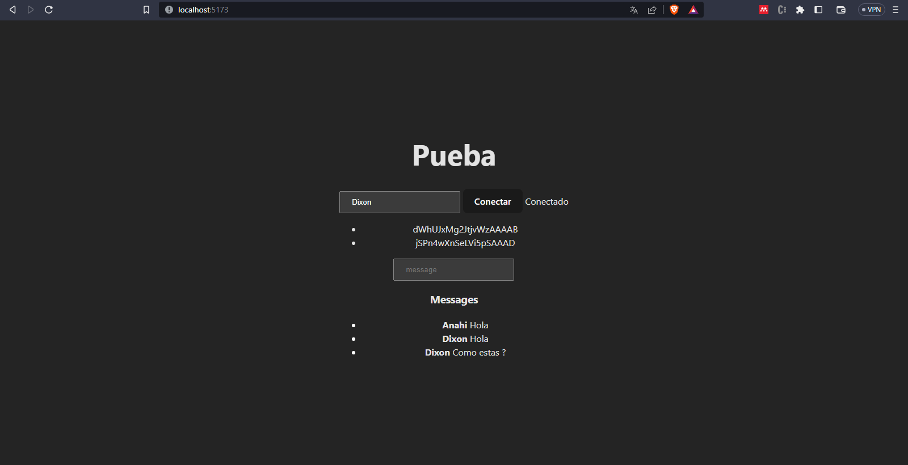
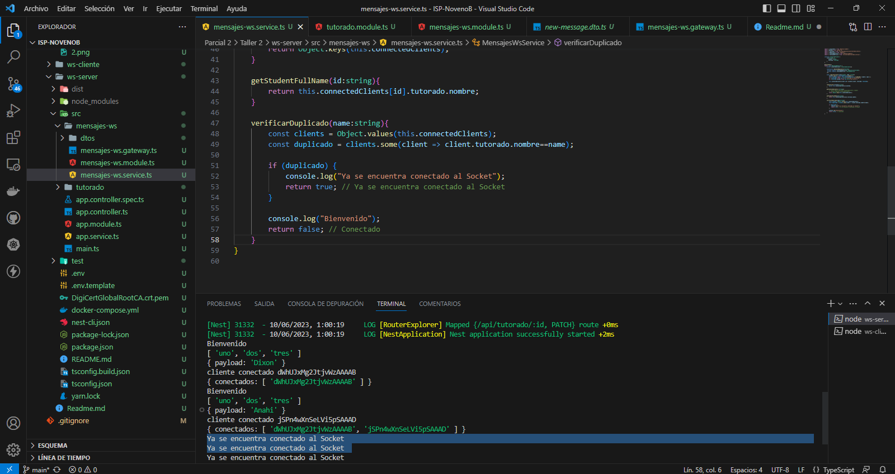

# Taller 2 Parcial 2

1. Evidencia de envio de mensaje y recepcion de mensaje entre instancias de frontend.  
 
 

2. Evidencia de que dos clientes web con el mismo nombre no puedan conectarse más de una vez. 
 